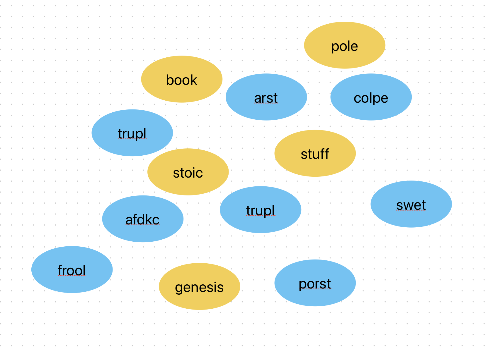
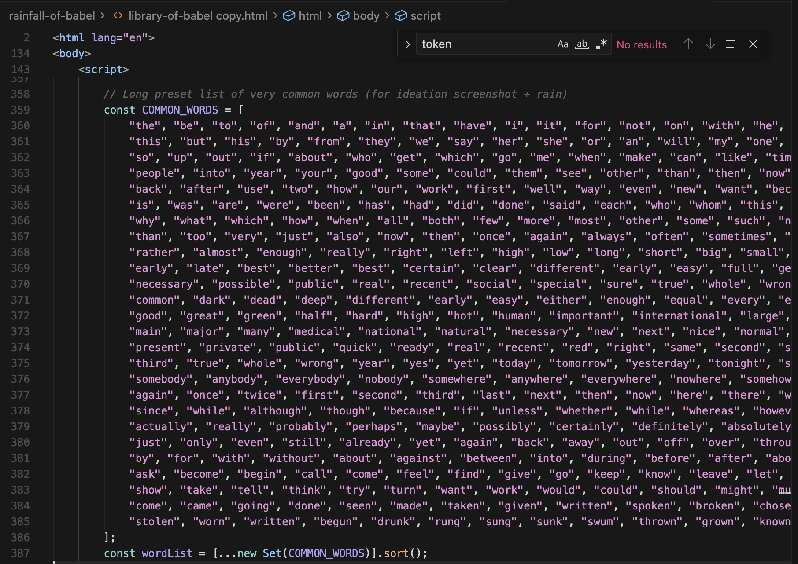

# Rainfall of Babel

An experimental, browser-based art piece inspired by Jorge Luis Borges' *The Library of Babel*.

https://github.com/user-attachments/assets/cc38cba3-e78b-4d2e-979b-c87265a5a5bd
## Showcase & Description

### Prelude

This artwork represents the role that humans play in giving meaning to language. Throughout the rainfall of generated "words", some shine bright while other's are dim, representing the "meaning" they contain. It's defined (and inspired by) by the words contained in the story of the Library of Babel. 

### Concept

- **Infinite noise**: The background renders Library-of-Babel–style nonsense text – a wall of unreadable possibility.
- **Language-shaped rain**: In front of that, words \"rain\" from the top of the screen. They are not chosen from a fixed list; instead, a **character-level Markov chain** is trained on the full text of *The Library of Babel*. It generates one character at a time, so words emerge naturally from the statistical shape of Borges' own sentences.
- **What counts as \"real\"**: Every falling "word" is checked against the vocabulary of the story. A word is considered *real* only if:
  - It appears somewhere in Borges' *Library of Babel* text, **and**
  - Its length is at least 4 characters (to de-emphasize tiny function words like \"the\", \"is\", \"of\").
- **Highlighting meaning**:
  - Real words are rendered in gold.
  - Longer real words (5+ letters) are treated as **rare** and glow brighter and slightly larger, making words like `library`, `hexagon`, `infinite`, `vindications` feel like small discoveries.
- **Sediment of text**: As the rain falls, every word—real or not—collects at the bottom of the page, forming a growing sediment of what the system has spoken so far.

Poetically, the piece treats Borges' story as the **only canon**: its letters generate the rain, and its vocabulary alone decides what lights up as meaningful. Meaning is whatever the Library has actually said, long enough to stand as a distinct word.

### Running the piece

- Open `library-of-babel.html` in a modern desktop browser (Chrome, Safari, Firefox, Edge).
- View it in full-screen for best effect.
- Let it run for a while; the experience is about **slow accumulation** and the occasional appearance of a striking, highlighted word.

### Controls / interaction

There is no UI or interaction beyond watching and waiting. The only \"action\" is time:

- The background text periodically regenerates its noise.
- The rain continues to generate new words from the Markov model.
- The bottom layer accumulates everything, like sediment in an infinite library.

### Technical notes

- **Generation**: A 3rd-order (order-3) character-level Markov chain is built from the full English text of *The Library of Babel*. For each 3-character window in the story, the code records which character actually followed it. During animation, it repeatedly:
  - Looks at the last 3 characters it has generated,
  - Samples one of the recorded \"next\" characters (weighted by how often it occurred in Borges' text),
  - Appends that to the stream.
- **Words**: The continuous character stream is then split into candidate words using a simple `[A–Z]`/`[a–z]` regex.
- **Highlighting**: A `Set` of all unique words from the story is precomputed. A falling token is highlighted if and only if its lowercase form is in that set and its length ≥ 4. A separate length check (≥ 5) drives the rarer, brighter style.

The goal is not to reproduce Borges' story, but to stage a small, visual corner of his Library: an infinite-looking wall of noise, and a slow rain of words in which **recognition** and **statistics** together decide what we call meaning.

## Process

### Ideation & Design

#### Inspiration

I was inspired to create this artwork after listening to Max Kreminski, a human-computer interaction researcher that focuses in computational poetry, give a guest lecture for my DESINV 23 class. Their work made me realize the part we as humans play in giving meaning to a specific subset of all possible language. It's up to us, as humans, to decide what does or does not have meaning.

This insight reminded me of the story of the Library of Babel, or more specifically the internet-famous website libraryofbabel.info. The story of the Library of Babel (if I were to summarize in a few short words) describes a library that contains all possible combinations of all human language. So, for instance, this library would contain the first sentence you ever spoke, as well as your last, the password to your cellphone, as well as the seriel number printed on the back.

Amongst all this information, however, is an infinitely large amount of "nothingness". But it's because of our defintion of language, as humnans, that leaves this jargon labeled both as "jargon" and "nothingness". I wanted to capture this idea in a fun way through this artwork.

#### Initial Draft

This first draft of this project posed a similar thought experiment but expressed it in a much different format. My original idea was to have "words" on a bunch of chips, which each chip colored based on it's "realness". The chips would essentially collect in a pile, and then it would be the user's job to dig through the pile.

However, I decided not to take this route because I thought there would be a lack of motion, of which I believe heavily emphasizes the accumulation of meaning over time. This realization made me think about ways to express accumulation. Eventually, I landed on the idea of rainfall.

I then scaled back the idea from chips to simple words falling from the top of the screen to the bottom, with the highlighting expressing its "meaning". A snapshot of an initial brainstorming board I have is placed below.

Another choice I made had to do with the design of the word generation. At first, I had a set that contained a list of many common English words. Then, I had words randomly generated. If they were found in the list, they were highlighted. At first, this worked, with the overall visual effect satisfied.

However, as I thought deeper about the meaning and purpose of the computational art, I wondered if this "predefined list" approach achieved the meaning I was intending to express with this art. I noticed that words were being generated that *are* words but are *not* contained in this list. I saw this as a discrepancy.

So, I redesigned the way that words are generated. Rather than having a preset list of common words, I scraped the story of the Library of Babel and created a frequency map of 3-character sequences to the next most likely character (the technical specifics of this can be found above). A snapshot of the list of words I previously used can be seen below.

### Prototyping and Building

There were multiple design changes that I had to make as I started designing the artwork. For instance, there was one point where my code had a bug where too many words were generated at once. This was very quickly overwhelming, so I had to debug and reduce the amount of words generated in each tick. Also, at first I had any match to a 3-character sequence be highlighted. However, this highlighted utility words like "and" and "the", which oversatured the number of highlighted words on screen. So, I made there be a default length of 4 characters for a word to be highlighted. A screenshot of the "too many words" bug can be found below.

## Conclusion & Reflection

I really enjoyed making this artwork. It was a fun blend of a website that I find really interest, a story with fun historical context, and technology that I find very innovative. It was also very nice to express my interests creatively, and there was a specific sense of satisfaction about completing an artwork start to finish.

One key insight I had is that just because something "looks" correct, it does not mean it is exactly the right thing to do. I experienced this when trying to figure out what model to use for generating new words. I wanted to make sure the generation method represented the key philosophy that I wanted to get across.

To improve on this project in the future, I would like expand on the visual aspect of the artwork. Instead of words collecting at the bottom, I would maybe try to allow multiple ways to separate words from non-words. I would also like a way to visualze real English words that were generated but were not in the Library of Babel dataset.