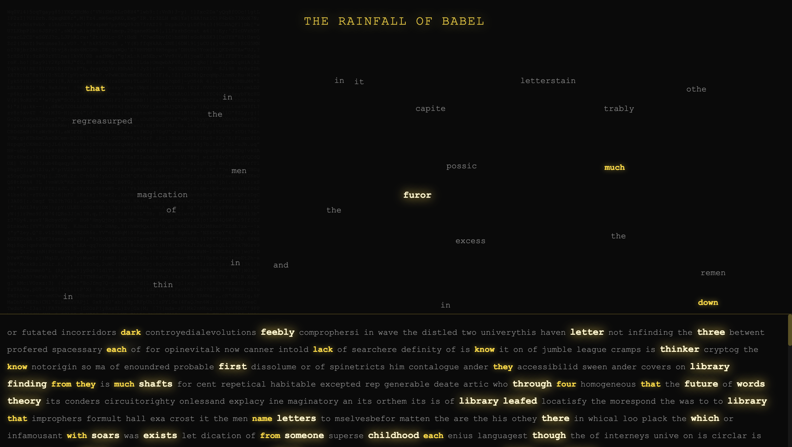

## Rainfall of Babel

An experimental, browser-based art piece inspired by Jorge Luis Borges' *The Library of Babel*.

https://github.com/user-attachments/assets/cc38cba3-e78b-4d2e-979b-c87265a5a5bd

### Concept

- **Infinite noise**: The background renders continuously regenerating, Library-of-Babel–style nonsense text – a wall of unreadable possibility.
- **Language-shaped rain**: In front of that, words \"rain\" from the top of the screen. They are not chosen from a fixed list; instead, a **character-level Markov chain** is trained on the full text of *The Library of Babel*. It generates one character at a time, so words emerge naturally from the statistical shape of Borges' own sentences.
- **What counts as \"real\"**: Every falling token is checked against the vocabulary of the story. A word is considered *real* only if:
  - It appears somewhere in Borges' *Library of Babel* text, **and**
  - Its length is at least 4 characters (to de-emphasize tiny function words like \"the\", \"is\", \"of\").
- **Highlighting meaning**:
  - Real words are rendered in gold.
  - Longer real words (5+ letters) are treated as **rare** and glow brighter and slightly larger, making words like `library`, `hexagon`, `infinite`, `vindications` feel like small discoveries.
- **Sediment of text**: As the rain falls, every word—real or not—collects at the bottom of the page, forming a growing sediment of what the system has spoken so far.

Poetically, the piece treats Borges' story as the **only canon**: its letters generate the rain, and its vocabulary alone decides what lights up as meaningful. Meaning is whatever the Library has actually said, long enough to stand as a distinct word.

### Running the piece

- Open `library-of-babel.html` in a modern desktop browser (Chrome, Safari, Firefox, Edge).
- View it in full-screen for best effect.
- Let it run for a while; the experience is about **slow accumulation** and the occasional appearance of a striking, highlighted word.

### Controls / interaction

There is no UI or interaction beyond watching and waiting. The only \"action\" is time:

- The background text periodically regenerates its noise.
- The rain continues to generate new words from the Markov model.
- The bottom layer accumulates everything, like sediment in an infinite library.

### Technical notes

- **Generation**: A 3rd-order (order-3) character-level Markov chain is built from the full English text of *The Library of Babel*. For each 3-character window in the story, the code records which character actually followed it. During animation, it repeatedly:
  - Looks at the last 3 characters it has generated,
  - Samples one of the recorded \"next\" characters (weighted by how often it occurred in Borges' text),
  - Appends that to the stream.
- **Words**: The continuous character stream is then split into candidate words using a simple `[A–Z]`/`[a–z]` regex.
- **Highlighting**: A `Set` of all unique words from the story is precomputed. A falling token is highlighted if and only if its lowercase form is in that set and its length ≥ 4. A separate length check (≥ 5) drives the rarer, brighter style.

The goal is not to reproduce Borges' story, but to stage a small, visual corner of his Library: an infinite-looking wall of noise, and a slow rain of words in which **recognition** and **statistics** together decide what we call meaning.